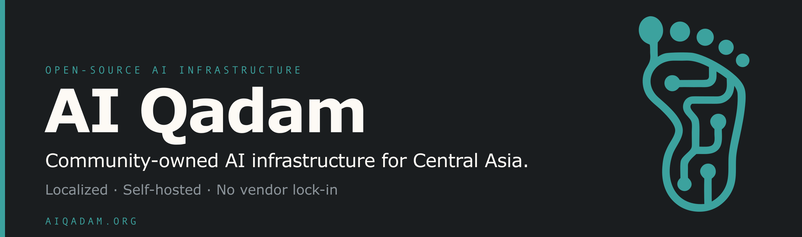

 

**Open, community-owned AI infrastructure for Central Asia.**
Localized. Self-hosted. No vendor lock-in.

---

## What we're building

**AI Qadam** ("قадам" — *a step forward*) is a community putting AI tooling into
the hands of the region that uses it. Not a rebrand of someone else's platform,
not a reseller — the software, the infrastructure, and the governance are all
owned and run here.

The bet is simple: **a region should own the infrastructure it depends on.**
So we adopt-and-localise where good open source already exists, and build new
where it doesn't — and we keep all of it open.

## The four streams

AI Qadam runs as four public streams, each a way people step in.

| Stream | What it is |
|---|---|
| 🎤 **Events** | Meetups, talks, and hands-on sessions across the region. |
| 📚 **Education** | Learning tracks and material that lower the barrier to building with AI. |
| 🤝 **People** | The community itself — contributors, chapter leads, speakers, mentors. |
| 🚀 **Accelerator** | Support for teams turning AI ideas into real products. |

## Build — the infrastructure layer

Underneath all four streams sits **[Build](https://build.aiqadam.org)** — the
open-source software AI Qadam owns and runs. Build is **not** a fifth stream and
**not** the accelerator; it's the foundation the streams stand on.

| Project | What it is | |
|---|---|---|
| **[Qadam Flow](https://flow.aiqadam.org)** | Workflow automation, built by the region, for the region — localized, self-hosted, no paywalls. | [`qadam-flow`](https://github.com/aiqadam/qadam-flow) |
| **[Brand Guidelines](https://brand.aiqadam.org)** | The canonical brand & design system — identity, voice, tokens, UI patterns. | [`brand.aiqadam.org`](https://github.com/aiqadam/brand.aiqadam.org) |

> Have infrastructure the community should own? Build works by
> **adopt-and-localise** or **build new** — open proposals welcome.
> Read the governance model at **[build.aiqadam.org](https://build.aiqadam.org)**.

## Repositories

| Repo | Description |
|---|---|
| [**qadam-flow**](https://github.com/aiqadam/qadam-flow) | Workflow automation — localized, self-hosted, no paywalls. |
| [**flow.aiqadam.org**](https://github.com/aiqadam/flow.aiqadam.org) | Public landing for Qadam Flow. |
| [**build.aiqadam.org**](https://github.com/aiqadam/build.aiqadam.org) | The open-source infrastructure layer of AI Qadam. |
| [**brand.aiqadam.org**](https://github.com/aiqadam/brand.aiqadam.org) | Brand & design system reference. |
| [**ai-qadam-platform**](https://github.com/aiqadam/ai-qadam-platform) | Platform for the AI Qadam community. |
| [**ai-qadam-infra**](https://github.com/aiqadam/ai-qadam-infra) | Infrastructure management for AI Qadam servers & services. |

## Get involved

- 🌐 Start at **[aiqadam.org](https://aiqadam.org)**
- 🛠️ See what Build is and how it's governed — **[build.aiqadam.org](https://build.aiqadam.org)**
- 💬 Pick a repo above, open an issue, or propose a project
- 📍 Based in Uzbekistan · building for Central Asia

 

*Localized. Self-hosted. No vendor lock-in.*

